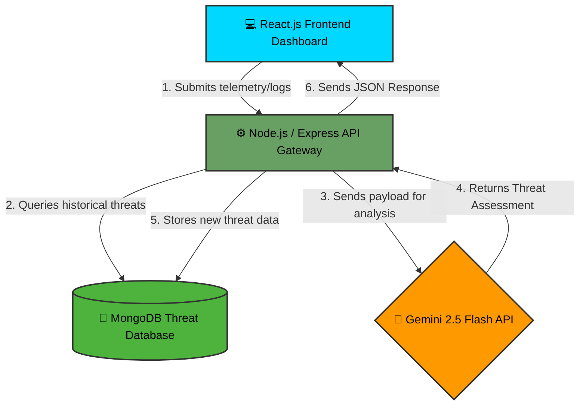

<div align="center">

  <br />

  
  <h1 align="center">🦅 KESTERAL AI Threat Analyzer</h1>

  <p align="center">
    <strong>Next-Gen AI Powered Threat Analysis & Deception Platform</strong>
    <br />
    <br />
    <a href="https://kestrel-ai-threat-analyzer.vercel.app"><strong>🔴 View Live Demo</strong></a>
    ·
    <a href="https://github.com/iprsnmsra/KESTERAL-AI-Threat-Analyzer/issues">Report Bug</a>
    ·
    <a href="https://github.com/iprsnmsra/KESTERAL-AI-Threat-Analyzer/pulls">Request Feature</a>
  </p>
</div>

<div align="center">
  


</div>

<br />

<details>
  <summary><strong>🔍 Table of Contents</strong></summary>
  <ol>
    <li><a href="#about-the-project">About The Project</a></li>
    <li><a href="#key-features">Key Features</a></li>
    <li><a href="#tech-stack">Tech Stack</a></li>
    <li><a href="#getting-started">Getting Started</a></li>
    <li><a href="#usage">Usage</a></li>
    <li><a href="#roadmap">Roadmap</a></li>
    <li><a href="#contributing">Contributing</a></li>
    <li><a href="#license">License</a></li>
    <li><a href="#contact">Contact</a></li>
  </ol>
</details>

---

## 🛡️ About The Project

**KESTERAL AI** is a cutting-edge web platform designed to assist security researchers and SOC analysts in identifying potential threats through advanced visualization and AI-driven heuristics. 

Unlike traditional static analyzers, KESTERAL integrates a **Deception Platform** methodology, allowing you to study threat behavior in a controlled, interactive environment. Whether you are analyzing network logs or simulating attack vectors, KESTERAL provides the clarity needed to make informed defense decisions.

### ⚡ Why KESTERAL?
* **Instant Analysis:** Rapidly process threat data directly from the web interface.
* **Deception Tech:** Utilize bait mechanisms to study attacker interaction.
* **Zero-Setup:** Fully deployed on Vercel for immediate access, or self-hostable via Node.js.

---

## 🚀 Key Features

| Feature | Description |
| :--- | :--- |
| 🤖 **AI-Assisted Analysis** | Uses heuristic algorithms to flag anomalies in provided datasets. |
| 🕸️ **Deception Modules** | Simulates vulnerable endpoints to trap and analyze malicious intent. |
| 📊 **Visual Dashboard** | Interactive charts and graphs for network traffic and threat levels. |
| ⚡ **Real-time API** | Built-in API endpoints for fetching latest threat intelligence. |
| ☁️ **Cloud Native** | Optimized for serverless deployment on Vercel. |

---

## 💻 Tech Stack

This project is built using modern web technologies to ensure speed, scalability, and ease of use.

* **Frontend:** HTML5, CSS3, JavaScript (ES6+)
* **Runtime:** Node.js
* **Deployment:** [Vercel](https://vercel.com/)
* **Package Manager:** NPM / Yarn


    
---

## 🏁 Getting Started

To get a local copy up and running, follow these simple steps.

### Prerequisites

* **Node.js** (v14 or higher recommended)
* **npm**

### Installation

1.  **Clone the Repo**
    ```bash
    git clone [https://github.com/iprsnmsra/KESTERAL-AI-Threat-Analyzer.git](https://github.com/Mr-DaRkAgeNt/KESTERAL-AI-Threat-Analyzer.git)
    cd KESTERAL-AI-Threat-Analyzer
    ```

2.  **Install Dependencies**
    ```bash
    npm install
    ```

3.  **Start the Local Server**
    ```bash
    npm start
    # OR
    node index.js
    ```

4.  **Access the Dashboard**
    Open your browser and navigate to `http://localhost:3000` (or the port specified in your console).

---

## 🛣️ Roadmap

- [x] **Phase 1:** Core UI & Basic Deception Modules (Released)
- [x] **Phase 2:** Integration with VirusTotal API
- [ ] **Phase 3:** Dark Mode & Mobile Responsiveness
- [ ] **Phase 4:** Docker Container Support
- [ ] **Phase 5:** Multi-Language Localization

See the [open issues](https://github.com/iprsnmsra/KESTERAL-AI-Threat-Analyzer/issues) for a full list of proposed features.

---

## 🤝 Contributing

Contributions are what make the open source community such an amazing place to learn, inspire, and create. Any contributions you make are **greatly appreciated**.

1.  Fork the Project
2.  Create your Feature Branch (`git checkout -b feature/AmazingFeature`)
3.  Commit your Changes (`git commit -m 'Add some AmazingFeature'`)
4.  Push to the Branch (`git push origin feature/AmazingFeature`)
5.  Open a Pull Request

---

## 🌟 Star History

[](https://star-history.com/#Mr-DaRkAgeNt/KESTERAL-AI-Threat-Analyzer&Date)

---
<!-- YOLO -->.

## 📜 License

Distributed under the **MIT License**. See `LICENSE` for more information.

---

## 📞 Contact

**iprsnmsra** - [GitHub Profile](https://github.com/iprsnmsra)

Project Link: [https://github.com/iprsnmsra/KESTERAL-AI-Threat-Analyzer](https://github.com/iprsnmsra/KESTERAL-AI-Threat-Analyzer)

<p align="center">
  
</p>
